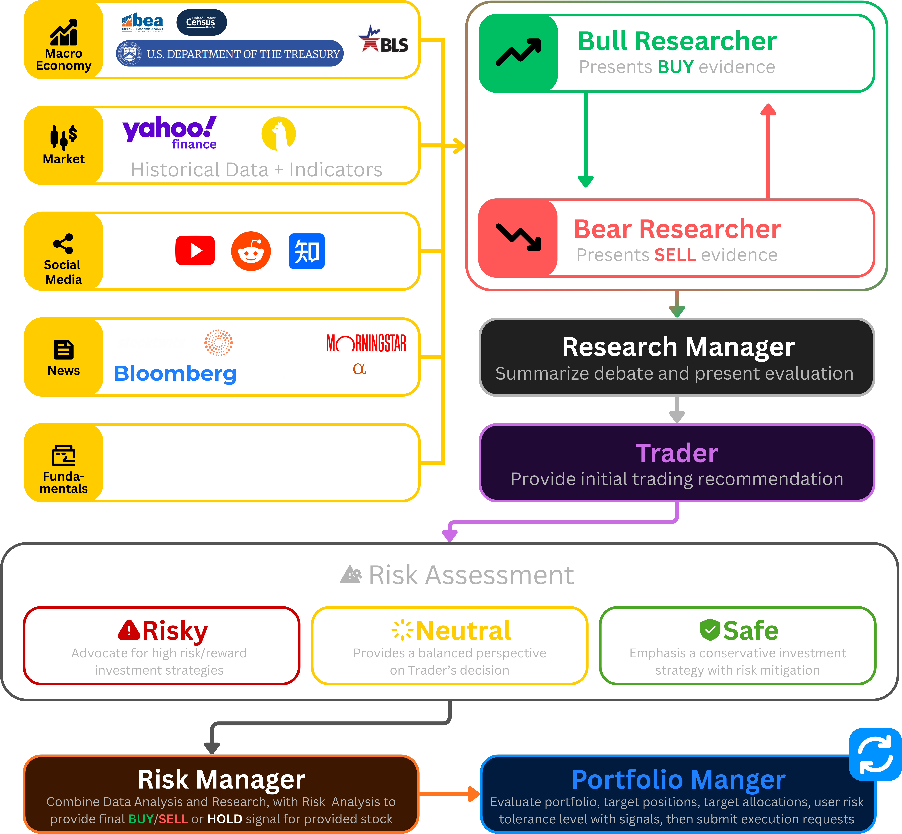
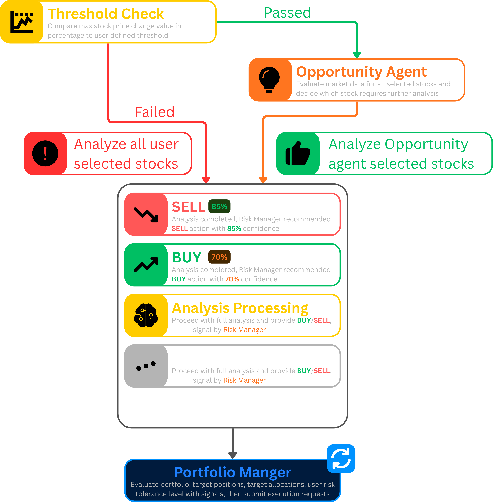

  
  
  # TradingGoose
  
  **Frontend Repository**
  
  An intelligent trading platform powered by multiple AI agents that collaborate to analyze markets, manage portfolios, and execute trades with sophisticated risk management.

## Overview

This repository contains the **frontend application** for the TradingGoose project - a comprehensive trading system that leverages a swarm of specialized AI agents to provide institutional-grade market analysis and automated trading capabilities. The platform combines fundamental analysis, technical indicators, news sentiment, and social media signals to make informed trading decisions.

This project's multi-agent analysis workflow architecture is based on the [TauricResearch/TradingAgents](https://github.com/TauricResearch/TradingAgents) framework, which pioneered the concept of collaborative AI agents for financial analysis.

## Features

### 🤖 Multi-Agent Architecture
- **Coordinator Agent**: Orchestrates analysis workflows and manages agent collaboration
- **Market Analyst**: Analyzes market trends and technical indicators
- **Fundamentals Analyst**: Evaluates company financials and valuation metrics
- **News Analyst**: Processes and interprets market news and events
- **Social Media Analyst**: Monitors social sentiment and trending topics
- **Risk Analysts** (Safe/Neutral/Risky): Provides multi-perspective risk assessments
- **Portfolio Manager**: Optimizes portfolio allocation and rebalancing
- **Trader Agent**: Executes trades based on collective intelligence

### 📊 Core Capabilities
- **Real-time Market Analysis**: Continuous monitoring of stocks and market conditions
- **Multi-Stock Analysis**: Analyze multiple stocks simultaneously in a single workflow
- **Portfolio Management**: Comprehensive portfolio optimization with position sizing and allocation strategies
- **Scheduled Rebalancing**: Automated portfolio rebalancing on daily, weekly, or monthly schedules
- **Live Trade Execution**: Real order execution through Alpaca Markets (paper and live trading)
- **Risk Assessment**: Multi-dimensional risk analysis from conservative to aggressive perspectives
- **Workflow Visualization**: Real-time tracking of analysis and decision-making processes
- **Historical Tracking**: Complete audit trail of analyses, trades, and rebalancing activities

### 🔐 Security & Access Control
- **Role-Based Access Control (RBAC)**: Granular permission system with admin, moderator, and user roles
- **Secure Authentication**: Supabase-powered authentication with email verification
- **Invitation System**: Controlled user onboarding through admin-managed invitations
- **API Key Management**: Secure storage and management of trading API credentials

## Tech Stack

### Frontend
- **React 18** with TypeScript
- **Vite** for fast development and building
- **TailwindCSS** for styling
- **Shadcn/ui** component library
- **React Router** for navigation
- **Recharts** for data visualization

### Backend
- **Supabase** for database, authentication, and real-time updates
- **Edge Functions** for serverless API endpoints
- **PostgreSQL** for data persistence
- **Row Level Security (RLS)** for data isolation
- **[Perplefina](https://github.com/Trading-Goose/Perplefina)** for comprehensive web search and data collection (news, fundamentals, social media, macro data)

### Trading Integration
- **Alpaca Markets API** for market data and trade execution
- **Customizable AI Providers** for agent intelligence (OpenAI, Anthropic, Google, and more)

## How It Works

### The Analysis Process

When you initiate a stock analysis, TradingGoose orchestrates a sophisticated multi-agent workflow:

1. **Data Gathering Phase**
   - Multiple data sources are queried simultaneously
   - Real-time market data, news, social sentiment, and fundamentals are collected
   - Historical patterns and technical indicators are analyzed

2. **Research & Debate Phase**
   - Bull Researcher agent presents positive evidence and growth potential
   - Bear Researcher agent identifies risks and presents cautionary analysis
   - Both perspectives are rigorously evaluated for balance

3. **Risk Assessment Phase**
   - Three specialized risk agents analyze from different perspectives:
     - **Safe Agent**: Conservative approach focusing on capital preservation
     - **Neutral Agent**: Balanced view weighing opportunities against risks
     - **Risky Agent**: Aggressive stance for high-growth potential

4. **Decision Synthesis**
   - Research Manager consolidates all agent insights
   - Risk Manager combines analyses with defined risk parameters
   - Portfolio Manager evaluates position sizing and portfolio impact

5. **Execution Ready**
   - Final recommendations are presented with confidence scores
   - Trade signals are generated based on collective intelligence
   - All analysis is logged for historical tracking

  

*Note: This workflow architecture is adapted from the [TauricResearch/TradingAgents](https://github.com/TauricResearch/TradingAgents) framework.*

### The Rebalancing Process

TradingGoose continuously monitors your portfolio and market conditions:

1. **Continuous Monitoring**
   - Price movements are tracked against user-defined thresholds
   - Portfolio allocations are compared to target weights
   - Market conditions are evaluated for rebalancing opportunities

2. **Opportunity Detection**
   - When thresholds are exceeded, the Opportunity Agent activates
   - Stocks requiring attention are identified and prioritized
   - Market-wide screening identifies new potential positions

3. **Strategic Analysis**
   - Selected stocks undergo full multi-agent analysis
   - Current positions are evaluated for scaling or exit
   - New opportunities are assessed for entry

4. **Portfolio Optimization**
   - Target allocations are calculated based on risk tolerance
   - Rebalancing trades are proposed to achieve optimal weights
   - Tax implications and transaction costs are considered

5. **Execution Management**
   - Proposed changes are presented for review
   - Approved rebalancing is executed through connected brokers
   - Performance tracking begins immediately post-execution

  

## Usage

### Running an Analysis
1. Navigate to the Dashboard
2. Enter a stock ticker in the search bar
3. Click "Analyze" to trigger the multi-agent workflow
4. Monitor progress in real-time through the workflow visualization
5. Review comprehensive insights from all agents

### Portfolio Rebalancing
1. Go to Settings > Rebalancing
2. Configure rebalancing settings (position sizes, thresholds, frequency)
3. Schedule automatic rebalancing or trigger manually
4. Review proposed changes before execution
5. Track rebalancing history and performance

## Key Features in Action

### Intelligent Analysis
- **Multi-perspective evaluation**: Every stock is analyzed from bullish and bearish viewpoints
- **Risk-adjusted recommendations**: Three risk profiles ensure suitable strategies for all investors
- **Confidence scoring**: Each recommendation includes transparency about certainty levels
- **Historical context**: Past performance and patterns inform future predictions

### Smart Portfolio Management
- **Automated rebalancing**: Maintains optimal portfolio allocation without manual intervention
- **Scheduled execution**: Set daily, weekly, or monthly rebalancing schedules that run automatically
- **Multi-stock portfolio analysis**: Evaluate entire portfolio health and opportunities across all holdings
- **Threshold-based triggers**: Customizable sensitivity to market movements
- **Real order execution**: Direct integration with Alpaca for live market orders
- **Position sizing algorithms**: Smart allocation based on risk, conviction, and portfolio balance
- **Tax-aware decisions**: Considers holding periods and tax implications
- **Dynamic position sizing**: Adjusts positions based on conviction and risk tolerance

### Real-time Monitoring
- **Live workflow visualization**: Watch agents collaborate in real-time
- **Progress tracking**: See exactly which phase of analysis is active
- **Performance metrics**: Track success rates and portfolio growth
- **Comprehensive audit trail**: Every decision is logged and traceable

## Security Considerations

- All API keys are stored encrypted in environment variables
- Database access is controlled through Row Level Security
- User actions are authenticated and authorized through RBAC
- Sensitive operations require admin privileges
- All trades can be executed in paper trading mode for testing

## License

This project is licensed under the AGPL-3.0 License - see the [LICENSE](LICENSE) file for details.

## Support

For issues, questions, or suggestions:
- Open an issue on GitHub
- Discord server coming soon! 🎮

## Development

🎉 **No humans were harmed in the making of this application!** 

This entire project was crafted with love by **[Claude Code](https://claude.ai/code)** - every single line of code, from the sleekest UI component to the smartest trading algorithm, was written by AI. Zero human-written code, 100% AI magic! 🪄

Who says robots can't be creative? This production-ready financial platform proves that AI can build sophisticated applications that actually work in the real world. Welcome to the future of software development! 🚀

## Acknowledgments

- Built with [Supabase](https://supabase.com)
- Trading powered by [Alpaca Markets](https://alpaca.markets)
- AI analysis powered by customizable providers (OpenAI, Anthropic, Google, and more)
- UI components from [shadcn/ui](https://ui.shadcn.com)
- Multi-agent architecture inspired by [TauricResearch/TradingAgents](https://github.com/TauricResearch/TradingAgents)
- **100% developed with [Claude Code](https://claude.ai/code)** 🤖

---

**Important**: Always conduct your own research and consider consulting with a financial advisor before making investment decisions. Past performance does not guarantee future results.