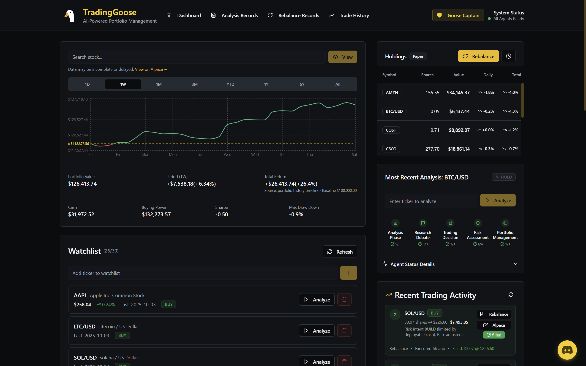
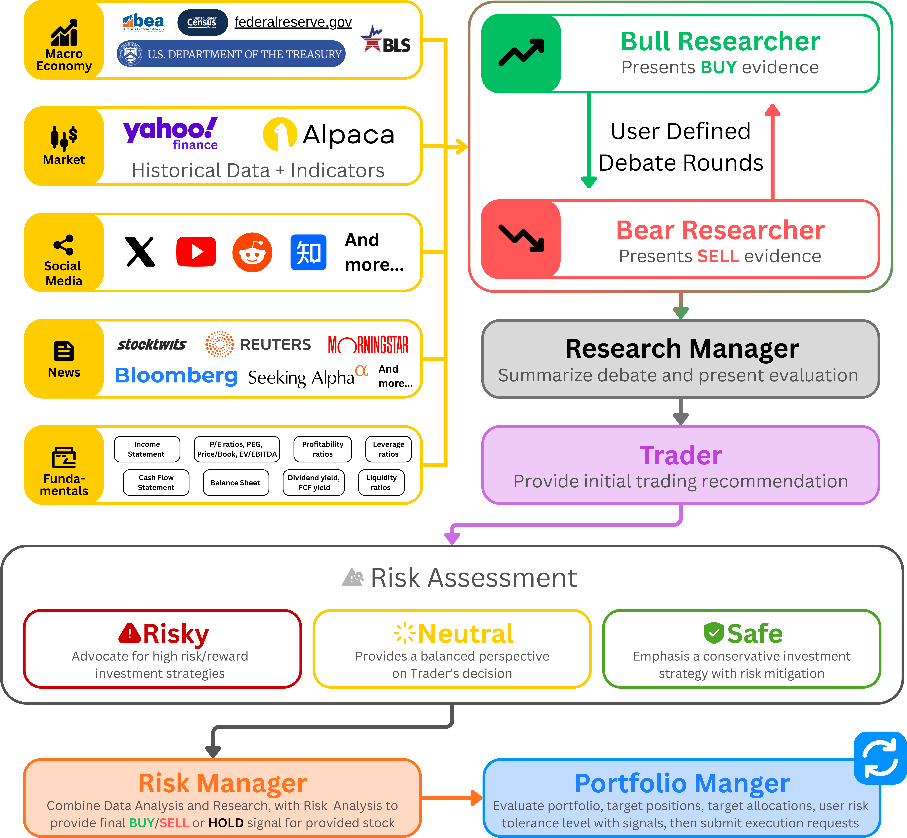
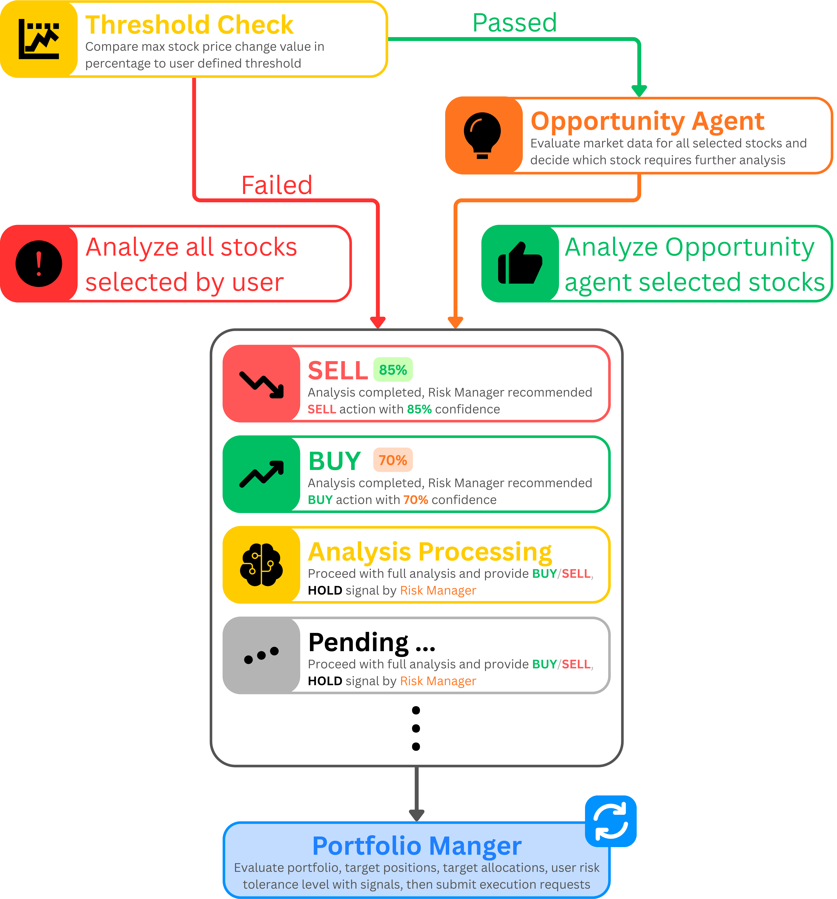

<h1 style="line-height:50px;" align="center"> TradingGoose </h1>

  
  An intelligent trading platform powered by multiple AI agents that collaborate to analyze markets, manage portfolios, and execute trades with sophisticated risk management.

  **[Open Source Version Available](https://github.com/Trading-Goose/Open-TradingGoose)** - Deploy your own instance!

## 📖 Overview

TradingGoose focuses on **event-driven trading strategy and analysis** that harnesses the power of AI agents and Alpaca's market data to deliver sophisticated trading recommendations and automated portfolio management insights. The system employs a multi-agent workflow architecture where specialized AI agents collaborate to analyze market-moving events in real-time.

### 🎯 Core Concept

The system leverages Large Language Models' natural language processing capabilities to rapidly analyze news, social media, and other textual data sources that often trigger market volatility. By processing these events faster than traditional methods, TradingGoose identifies potential market movements and generates timely trading signals for user-selected stocks.

### 🔄 Intelligent Execution

Once analysis agents provide their recommendations, the **Portfolio Manager AI agent** takes over to:
- Analyze the user's Alpaca account details and current portfolio state
- Consider user-configured position sizing, allocation strategies, and risk tolerance
- Generate final trading orders with precise values and actions for specific tickers
- Make autonomous decisions that may differ from initial recommendations based on actual portfolio constraints and risk management

This two-layer approach ensures that while the analysis agents focus on identifying opportunities, the portfolio manager maintains discipline in execution, potentially overriding recommendations when they conflict with portfolio health, risk limits, or allocation rules.

### 🏗️ Architecture Foundation

This project's multi-agent analysis workflow architecture is based on the [TauricResearch/TradingAgents](https://github.com/TauricResearch/TradingAgents) framework, which pioneered the concept of collaborative AI agents for financial analysis.

## ✨ Features

### 🤖 Multi-Agent Architecture

- **Coordinator Agent**: Orchestrates analysis workflows and manages agent collaboration
- **Market Analyst**: Analyzes market trends and technical indicators
- **Fundamentals Analyst**: Evaluates company financials and valuation metrics
- **News Analyst**: Processes and interprets market news and events
- **Social Media Analyst**: Monitors social sentiment and trending topics
- **Risk Analysts** (Safe/Neutral/Risky): Provides multi-perspective risk assessments
- **Portfolio Manager**: Optimizes portfolio allocation and rebalancing

### 📊 Core Capabilities

- **Real-time Market Analysis**: Continuous monitoring of stocks and market conditions
- **Multi-Stock Analysis**: Analyze multiple stocks simultaneously in a single workflow
- **Portfolio Management**: Comprehensive portfolio optimization with position sizing and allocation strategies
- **Scheduled Rebalancing**: Automated portfolio rebalancing on daily, weekly, or monthly schedules
- **Live Trade Execution**: Real order execution through Alpaca Markets (paper and live trading)
- **Risk Assessment**: Multi-dimensional risk analysis from conservative to aggressive perspectives
- **Workflow Visualization**: Real-time tracking of analysis and decision-making processes
- **Historical Tracking**: Complete audit trail of analyses, trades, and rebalancing activities

### 🔐 Security & Access Control

- **Role-Based Access Control (RBAC)**: Granular permission system with admin, moderator, and user roles
- **Secure Authentication**: Supabase-powered authentication with email verification
- **Invitation System**: Controlled user onboarding through admin-managed invitations
- **API Key Management**: Secure storage and management of trading API credentials

## 🛠️ Tech Stack

### 🎨 Frontend

- **React 18** with TypeScript
- **Vite** for fast development and building
- **TailwindCSS** for styling
- **Shadcn/ui** component library
- **React Router** for navigation
- **Recharts** for data visualization

### ⚙️ Backend

- **Supabase** for database, authentication, and real-time updates
- **Edge Functions** for serverless API endpoints & running workflow in background
- **PostgreSQL** for data persistence
- **Row Level Security (RLS)** for data isolation

### 📈 Trading Integration

- **Alpaca Markets API** for market data and trade execution
- **Customizable AI Providers** for agent intelligence (OpenAI, Anthropic, Google, and more)

---

 

## 🔄 How It Works

### 🔬 The Analysis Process

When you initiate a stock analysis, TradingGoose orchestrates a sophisticated multi-agent workflow:

<picture style="width:50%">
  <source media="(prefers-color-scheme: dark)" srcset="public/Analysis-Flow-dark.png">
  <source media="(prefers-color-scheme: light)" srcset="public/Analysis-Flow-light.png">
  
</picture>

###### _Note: This workflow architecture is adapted from the [TauricResearch/TradingAgents](https://github.com/TauricResearch/TradingAgents) framework._

<strong>1. 📊 Data Analysis Phase</strong>

- **🌍 Macro Analyst**: Government data and economic indicators
- **📈 Market Analyst**: Historical data and technical indicators
- **📰 News Analyst**: Latest news and sentiment analysis
- **💬 Social Media Analyst**: Social platform trends and impact
- **💰 Fundamentals Analyst**: Financial statements and profitability

<strong>2. 🔍 Research & Debate Phase</strong>

- 🐂 Bull Researcher agent presents positive evidence and growth potential
- 🐻 Bear Researcher agent identifies risks and presents cautionary analysis
- ⚖️ Both perspectives are rigorously evaluated for balance

<strong>3. ⚠️ Risk Assessment Phase</strong>

- Three specialized risk agents analyze from different perspectives:
  - **🛡️ Safe Agent**: Conservative approach focusing on capital preservation
  - **⚖️ Neutral Agent**: Balanced view weighing opportunities against risks
  - **🚀 Risky Agent**: Aggressive stance for high-growth potential
  

<strong>4. 🧩 Decision Synthesis</strong>

- 📋 Research Manager consolidates all agent insights
- 🎯 Risk Manager combines analyses with defined risk parameters
- 💼 Portfolio Manager evaluates position sizing and portfolio impact

<strong>5. ✅ Execution Ready</strong>

- 📊 Final recommendations are presented with confidence scores
- 🚦 Trade signals are generated based on collective intelligence
- 📝 All analysis is logged for historical tracking

 

### ⚖️ The Rebalancing Process

TradingGoose continuously monitors your portfolio and market conditions:

<picture>
  <source media="(prefers-color-scheme: dark)" srcset="public/Rebalance-Flow-dark.png">
  <source media="(prefers-color-scheme: light)" srcset="public/Rebalance-Flow-light.png">
  
</picture>

<strong>1. 👁️ Continuous Monitoring</strong>

- 📉 Price movements are tracked against user-defined thresholds
- 🎯 Portfolio allocations are compared to target weights
- 🌐 Market conditions are evaluated for rebalancing opportunities

<strong>2. 🎯 Opportunity Detection</strong>

- 🚨 When thresholds are exceeded, the Opportunity Agent activates
- 📍 Stocks requiring attention are identified and prioritized
- 🔎 Market-wide screening identifies new potential positions

<strong>3. 🎲 Strategic Analysis</strong>

- 🔬 Selected stocks undergo full multi-agent analysis
- 📊 Current positions are evaluated for scaling or exit
- 🆕 New opportunities are assessed for entry

<strong>4. 🎨 Portfolio Optimization</strong>

- 🎯 Target allocations are calculated based on risk tolerance
- ⚖️ Rebalancing trades are proposed to achieve optimal weights
- 💸 Tax implications and transaction costs are considered

<strong>5. 🚀 Execution Management</strong>

- 📋 Proposed changes are presented for review
- ✅ Approved rebalancing is executed through connected brokers
- 📈 Performance tracking begins immediately post-execution

---

 

## 🚀 Usage

### 🔍 Running an Analysis

1. Navigate to the Dashboard
2. Enter a stock ticker in the search bar
3. Click "Analyze" to trigger the multi-agent workflow
4. Monitor progress in real-time through the workflow visualization
5. Review comprehensive insights from all agents

### 💼 Portfolio Rebalancing

1. Go to Settings > Rebalancing
2. Configure rebalancing settings (position sizes, thresholds, frequency)
3. Schedule automatic rebalancing or trigger manually
4. Review proposed changes before execution
5. Track rebalancing history and performance

## 🌟 Key Features in Action

### 🧠 Intelligent Analysis

- **Multi-perspective evaluation**: Every stock is analyzed from bullish and bearish viewpoints
- **Risk-adjusted recommendations**: Three risk profiles ensure suitable strategies for all investors
- **Confidence scoring**: Each recommendation includes transparency about certainty levels
- **Historical context**: Past performance and patterns inform future predictions

### 💎 Smart Portfolio Management

- **Automated rebalancing**: Maintains optimal portfolio allocation without manual intervention
- **Scheduled execution**: Set daily, weekly, or monthly rebalancing schedules that run automatically
- **Multi-stock portfolio analysis**: Evaluate entire portfolio health and opportunities across all holdings
- **Threshold-based triggers**: Customizable sensitivity to market movements
- **Real order execution**: Direct integration with Alpaca for live market orders
- **Position sizing algorithms**: Smart allocation based on risk, conviction, and portfolio balance
- **Tax-aware decisions**: Considers holding periods and tax implications
- **Dynamic position sizing**: Adjusts positions based on conviction and risk tolerance

### 📡 Real-time Monitoring

- **Live workflow visualization**: Watch agents collaborate in real-time
- **Progress tracking**: See exactly which phase of analysis is active
- **Performance metrics**: Track success rates and portfolio growth
- **Comprehensive audit trail**: Every decision is logged and traceable

## 🔒 Security Considerations

- All API keys are stored encrypted in environment variables
- Database access is controlled through Row Level Security
- User actions are authenticated and authorized through RBAC
- Sensitive operations require admin privileges
- All trades can be executed in paper trading mode for testing

## 📄 License

This project is licensed under the AGPL-3.0 License - see the [LICENSE](LICENSE) file for details.

## 💬 Support

For issues, questions, or suggestions:

- Open an issue on GitHub
- Join our [Discord community](https://discord.gg/3dkTaNyp) 🎮

## 🚧 Development

🎉 **No humans were harmed in the making of this application!**

This entire project was crafted with love by **[Claude Code](https://claude.ai/code)** - every single line of code, from the sleekest UI component to the smartest trading algorithm, was written by AI. Zero human-written code, 100% AI magic! 🪄

Who says robots can't be creative? This production-ready financial platform proves that AI can build sophisticated applications that actually work in the real world. Welcome to the future of software development! 🚀

---

 

### ✅ Feature Checklist

#### Analysis Features

- [x] Multi-stock concurrent analysis
- [x] Cancel/delete running analysis
- [x] Retry failed analysis from specific failed agent
- [x] Reactivate stale/stuck analysis workflows
- [x] Real-time workflow visualization with progress tracking
- [x] Historical analysis tracking and audit trail

#### Portfolio Management

- [x] Automated Scheduled rebalancing (daily/weekly/monthly)
- [x] Manual rebalancing triggers
- [x] Position size configuration (min/max)
- [x] Multi-stock portfolio monitoring

#### Trading Features

- [x] Paper trading mode for testing
- [x] Live trading execution via Alpaca
- [x] Real-time order status tracking
- [x] Position management and monitoring

#### AI Configuration

- [x] Multiple AI provider support (OpenAI, Anthropic/Claude, Google, DeepSeek)
- [x] Custom max tokens configuration per agent
- [x] Provider failover and retry logic
- [x] Model selection flexibility

####Data & Analysis

- [x] Historical data range selection
- [x] Custom analysis timeframes
- [x] Technical indicator calculations
- [x] Fundamental data integration
- [x] News sentiment analysis
- [x] Social media trend tracking

#### User Management

- [x] User Acount system
- [x] API key management interface
- [x] User activity tracking
- [x] Secure credential storage

## 🙏 Acknowledgments

- Built with [Supabase](https://supabase.com)
- Trading powered by [Alpaca Markets](https://alpaca.markets)
- AI analysis powered by customizable providers (OpenAI, Anthropic, Google, and more)
- UI components from [shadcn/ui](https://ui.shadcn.com)
- Multi-agent architecture inspired by [TauricResearch/TradingAgents](https://github.com/TauricResearch/TradingAgents)
- **100% developed with [Claude Code](https://claude.ai/code)** 🤖

---

**Important**: Always conduct your own research and consider consulting with a financial advisor before making investment decisions. Past performance does not guarantee future results.
