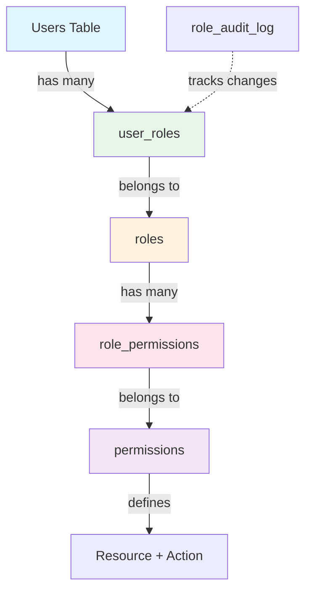
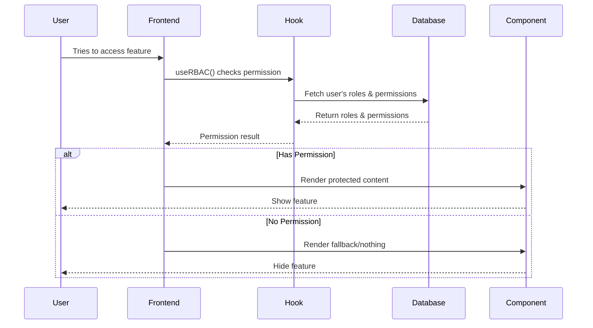

# Role-Based Access Control (RBAC) System Documentation

## How It Works

### 1. Core Concept
The RBAC system uses a **hierarchical permission model** where:
- **Users** are assigned to **Roles**
- **Roles** have **Permissions**
- **Permissions** control access to **Resources** and **Actions**

```
User → Has Roles → Have Permissions → Control Access
```

## System Architecture

### Database Structure



### Permission Flow



## Database Tables

### 1. `roles` Table
Stores role definitions with priority levels:

| Column | Type | Description |
|--------|------|-------------|
| id | UUID | Primary key |
| name | VARCHAR | Unique identifier (e.g., 'admin') |
| display_name | VARCHAR | Human-readable name |
| priority | INTEGER | Higher = more important |

### 2. `permissions` Table
Defines granular permissions:

| Column | Type | Description |
|--------|------|-------------|
| id | UUID | Primary key |
| name | VARCHAR | Permission identifier (e.g., 'users.create') |
| resource | VARCHAR | Resource type (e.g., 'users') |
| action | VARCHAR | Action type (e.g., 'create') |

### 3. `user_roles` Table
Assigns roles to users:

| Column | Type | Description |
|--------|------|-------------|
| user_id | UUID | Reference to user |
| role_id | UUID | Reference to role |
| is_active | BOOLEAN | Whether role is active |
| expires_at | TIMESTAMP | Optional expiration |

### 4. `role_permissions` Table
Links roles to permissions:

| Column | Type | Description |
|--------|------|-------------|
| role_id | UUID | Reference to role |
| permission_id | UUID | Reference to permission |

## How Permissions Are Checked

### Step-by-Step Process

1. **User Login**
   ```typescript
   // User authenticates with Supabase
   const { user } = await supabase.auth.signIn(...)
   ```

2. **Load User's Roles & Permissions**
   ```typescript
   // useRBAC hook automatically fetches on mount
   const { roles, permissions } = useRBAC();
   ```

3. **Database Query (Behind the Scenes)**
   ```sql
   -- Get user's active roles
   SELECT r.* FROM roles r
   JOIN user_roles ur ON r.id = ur.role_id
   WHERE ur.user_id = $1 
     AND ur.is_active = true
     AND (ur.expires_at IS NULL OR ur.expires_at > NOW())
   
   -- Get permissions for those roles
   SELECT DISTINCT p.* FROM permissions p
   JOIN role_permissions rp ON p.id = rp.permission_id
   JOIN user_roles ur ON rp.role_id = ur.role_id
   WHERE ur.user_id = $1
   ```

4. **Frontend Permission Check**
   ```typescript
   // Component level
   if (hasPermission('invitations.create')) {
     // Show create invitation button
   }
   
   // Or using components
   <RoleGate permissions={['invitations.create']}>
     <CreateInvitationButton />
   </RoleGate>
   ```

## Permission Naming Convention

Permissions follow the pattern: `resource.action`

Examples:
- `users.create` - Can create new users
- `users.read` - Can view user information
- `users.update` - Can edit users
- `users.delete` - Can delete users
- `analysis.export` - Can export analysis data
- `settings.update` - Can modify system settings

## Role Hierarchy

```
super_admin (priority: 100)
    ├── ALL PERMISSIONS
    
admin (priority: 80)
    ├── users.* (except delete)
    ├── invitations.*
    ├── analysis.*
    ├── reports.*
    └── settings.read

moderator (priority: 60)
    ├── users.read, users.update
    ├── invitations.read
    ├── analysis.read, analysis.update
    └── reports.view

analyst (priority: 40)
    ├── analysis.*
    ├── reports.view
    └── api.elevated

user (priority: 20)
    ├── analysis.create, analysis.read
    └── settings.read

guest (priority: 10)
    └── limited read permissions
```

## Usage Examples

### 1. Basic Permission Check
```typescript
function DeleteButton() {
  const { hasPermission } = useRBAC();
  
  if (!hasPermission('users.delete')) {
    return null; // Don't show button
  }
  
  return <Button onClick={handleDelete}>Delete User</Button>;
}
```

### 2. Multiple Permission Check
```typescript
// Requires ANY of these permissions
<RoleGate permissions={['admin.access', 'moderator.access']}>
  <AdminPanel />
</RoleGate>

// Requires ALL permissions
<RoleGate 
  permissions={['users.read', 'users.update']} 
  requireAll={true}
>
  <UserEditForm />
</RoleGate>
```

### 3. Role-Based Rendering
```typescript
function UserProfile() {
  const { hasRole, getPrimaryRole } = useRBAC();
  const primaryRole = getPrimaryRole();
  
  return (
    <div>
      <h1>Welcome {user.name}</h1>
      <RoleBadge /> {/* Shows user's role */}
      
      {hasRole('admin') && (
        <AdminDashboard />
      )}
      
      {hasRole('analyst') && (
        <AnalystTools />
      )}
    </div>
  );
}
```

### 4. Resource-Action Check
```typescript
<ResourceActionGate resource="analysis" action="export">
  <ExportButton />
</ResourceActionGate>
```

### 5. Programmatic Permission Check
```typescript
async function handleAction() {
  const { canPerform } = useRBAC();
  
  if (!canPerform('analysis', 'delete')) {
    toast.error('You don\'t have permission to delete analysis');
    return;
  }
  
  // Proceed with deletion
  await deleteAnalysis(id);
}
```

## Adding New Roles or Permissions

### 1. Add New Role
```sql
INSERT INTO roles (name, display_name, priority) 
VALUES ('data_scientist', 'Data Scientist', 50);
```

### 2. Add New Permission
```sql
INSERT INTO permissions (name, resource, action) 
VALUES ('ml_models.train', 'ml_models', 'train');
```

### 3. Assign Permission to Role
```sql
INSERT INTO role_permissions (role_id, permission_id)
SELECT r.id, p.id 
FROM roles r, permissions p
WHERE r.name = 'data_scientist' 
  AND p.name = 'ml_models.train';
```

### 4. Assign Role to User
```sql
INSERT INTO user_roles (user_id, role_id, is_active)
SELECT 'user-uuid-here', id, true 
FROM roles 
WHERE name = 'data_scientist';
```

## Security Features

### 1. Audit Logging
All role changes are logged:
```sql
-- Automatic logging of role assignments
INSERT INTO role_audit_log (user_id, target_user_id, action, role_id)
VALUES ($admin_id, $user_id, 'grant', $role_id);
```

### 2. Expiring Roles
Roles can have expiration dates:
```sql
-- Grant temporary admin access for 7 days
INSERT INTO user_roles (user_id, role_id, expires_at)
VALUES ($user_id, $admin_role_id, NOW() + INTERVAL '7 days');
```

### 3. Row Level Security (RLS)
Database enforces permissions at the row level:
```sql
-- Users can only see their own roles
CREATE POLICY "Users can view own roles" ON user_roles
FOR SELECT USING (auth.uid() = user_id);
```

## Performance Optimizations

### 1. Caching
Frontend caches permissions for 5 minutes:
```typescript
const CACHE_DURATION = 5 * 60 * 1000; // 5 minutes
localStorage.setItem('rbac_cache', JSON.stringify({
  roles,
  permissions,
  timestamp: Date.now()
}));
```

### 2. Database Indexes
Fast lookups with proper indexing:
```sql
CREATE INDEX idx_user_roles_user_id ON user_roles(user_id);
CREATE INDEX idx_role_permissions_role_id ON role_permissions(role_id);
```

### 3. Batched Queries
Single query fetches all permissions:
```sql
-- One query instead of multiple
SELECT DISTINCT p.* 
FROM permissions p
JOIN role_permissions rp ON p.id = rp.permission_id
JOIN user_roles ur ON rp.role_id = ur.role_id
WHERE ur.user_id = $1;
```

## Testing Permissions

### 1. Check Current User's Permissions
```typescript
// In browser console
const { permissions, roles } = useRBAC();
console.log('Roles:', roles);
console.log('Permissions:', permissions);
```

### 2. Test Permission Logic
```typescript
// Test specific permission
console.log('Can create users?', hasPermission('users.create'));
console.log('Is admin?', hasRole('admin'));
```

### 3. Database Query
```sql
-- Check user's roles and permissions
SELECT * FROM get_user_roles('user-uuid-here');
SELECT * FROM get_user_permissions('user-uuid-here');
```

## Common Patterns

### 1. Admin-Only Features
```typescript
<RoleGate roles={['admin', 'super_admin']}>
  <AdminFeature />
</RoleGate>
```

### 2. Progressive Enhancement
```typescript
function AnalysisView({ analysis }) {
  const { hasPermission } = useRBAC();
  
  return (
    <div>
      <ViewAnalysis data={analysis} />
      
      {hasPermission('analysis.update') && (
        <EditButton />
      )}
      
      {hasPermission('analysis.delete') && (
        <DeleteButton />
      )}
      
      {hasPermission('analysis.export') && (
        <ExportButton />
      )}
    </div>
  );
}
```

### 3. API Protection
```typescript
// Backend edge function
const hasPermission = await supabase.rpc('user_has_permission', {
  p_user_id: user.id,
  p_permission_name: 'api.unlimited'
});

if (!hasPermission) {
  return new Response('Forbidden', { status: 403 });
}
```

## Troubleshooting

### Issue: User can't access feature despite having role
**Solution**: Check if:
1. Role is active: `is_active = true`
2. Role hasn't expired: `expires_at > NOW()`
3. Permission is assigned to role
4. Frontend cache is cleared

### Issue: Permission changes don't reflect immediately
**Solution**: 
1. Call `refresh()` from useRBAC hook
2. Clear localStorage cache
3. Reload the page

### Issue: Super admin can't access everything
**Solution**: Ensure super_admin role has all permissions:
```sql
-- Re-assign all permissions to super_admin
INSERT INTO role_permissions (role_id, permission_id)
SELECT r.id, p.id 
FROM roles r, permissions p
WHERE r.name = 'super_admin'
ON CONFLICT DO NOTHING;
```